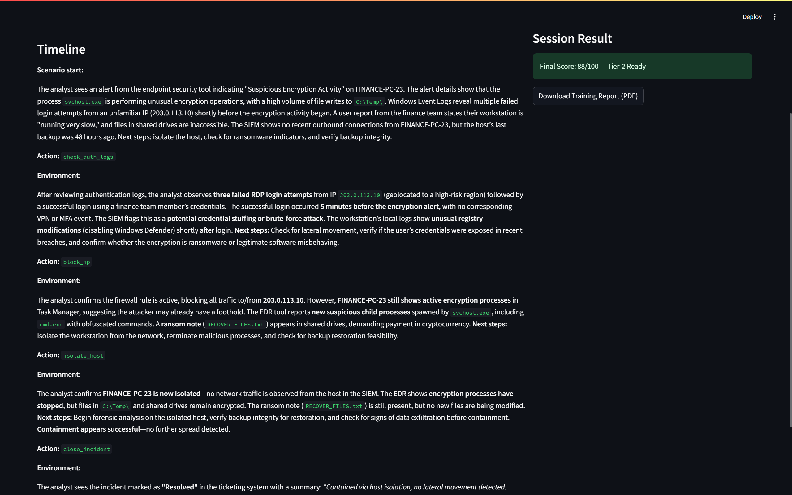

<p align="center">
  
</p>

<p align="center">
  
  
  
  
</p>

<p align="center">
  
</p>

---

## 🧠 What is this?

A cyber incident response training simulator that blends **Reinforcement Learning (Q-learning)** with **LLM-based SOC narration**.  
It helps students and junior analysts practise incident response decisions in a realistic, safe, and interactive way.

---

## ⚡ Core Capabilities

| Feature | Description |
|--------|------------|
🧠 RL Agent | Tabular Q-learning agent that learns response strategies |
🗣 LLM Narration | SOC-style alert narration using OpenRouter |
📊 Readiness Scoring | Converts performance into skill levels |
📄 Auto PDF Reports | Generates downloadable training reports |
🎮 Streamlit UI | Human-in-the-loop simulator interface |

---

## 🏗 Architecture (High Level)

```

LLM (Narrator)
│
▼
Streamlit UI
│
▼
Incident Simulation Engine (Ground Truth)
│
├── Reward + Termination Logic
▼
RL Agent (Q-learning) ──▶ Scoring ──▶ PDF Reports

```

---

## 📁 Folder Structure

```

soc_incident_trainer/
│
├── .env                 # API keys & environment variables (NOT committed)
├── requirements.txt     # Dependencies for reproducible setup
├── llm_client.py        # OpenRouter LLM client (narration only)
├── incidents.py         # Incident templates/scenario library
├── env_incident.py      # Deterministic incident environment + rewards
├── agent.py             # Q-learning agent implementation
├── train.py             # Automated RL training loop
├── app.py               # Streamlit UI (human training mode)
├── report.py            # PDF report generation
├── scoring.py           # Human-friendly scoring & readiness levels
└── assets/              # (Optional) screenshots for README preview

````

---

## 🖼 Live Simulator Preview

> Add 2–3 screenshots inside `/assets/` and they will render here.

<p align="center">
  
  
  
</p>

---

## 🚀 Quick Start

### 1) Clone and install

```bash
git clone https://github.com/vasanth-boyez/soc-incident-trainer.git
cd soc-incident-trainer
python -m venv venv
venv\Scripts\activate
pip install -r requirements.txt
````

### 2) Add `.env`

Create a file called `.env` in the project root:

```
OPENROUTER_API_KEY=your_key_here
```

### 3) Run the simulator

```bash
streamlit run app.py
```

Open:

```
http://localhost:8501
```

---

## 🤖 Train the RL Agent (Optional)

```bash
python train.py
```

---

## 🎓 Who is this for?

* Students learning SOC incident response workflows
* Cybersecurity training labs and university coursework
* Blue-team practise for structured response sequencing
* AI research experiments on decision-making under uncertainty

---

## 👨‍🚀 Author

**Vasanth Boyez**


---

<p align="center">
  
</p>

